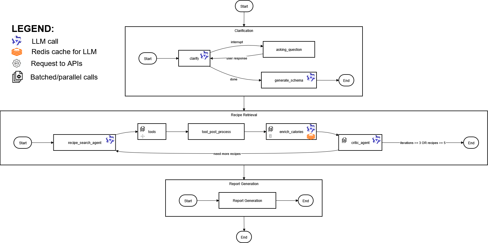
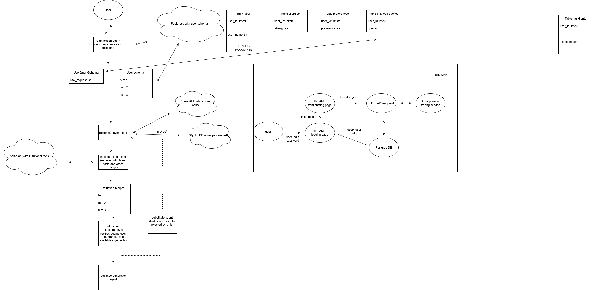

# Cooking LLM Agent 

A multi-agent system that helps you discover recipes based on your preferences, dietary restrictions, and available ingredients.

**Authors:** Turushev Timur, Egor Shmelev, Ran Duan, Jorge Sosa  
**Course:** ML in Industry (ITMO)

## Key Features

- **Personalization** — Stores your preferences, allergies, and query history to tailor recipe recommendations
- **Real Recipe API** — Uses TheMealDB API for authentic recipes, eliminating LLM hallucinations like "pork wings"
- **Multi-Agent Architecture** — Specialized agents for clarification, search, critique, and report generation
- **Calorie Enrichment** — Automatically calculates nutritional information for recipes
- **Interactive Clarification** — Asks follow-up questions when your request needs more details

## Architecture

The system uses LangGraph to orchestrate four specialized subgraphs:



The Recipe Retrieval and Critic agents form a **ReAct-style loop**: the retrieval agent searches for recipes, the critic evaluates them against user requirements and provides feedback. If results are insufficient, the loop continues with refined searches (up to 3 iterations).

| Agent | Purpose |
|-------|---------|
| **Clarification** | Human-in-the-loop: asks follow-up questions until requirements are clear |
| **Schema Generation** | Planning stage: summarizes conversation into structured `UserRecipeQuery` |
| **Recipe Retrieval** | Searches recipes by name, ingredients, or cuisine area |
| **Critic** | Evaluates and filters recipes, provides feedback for next iteration |
| **Report Generation** | Formats selected recipes with ingredients, calories, and instructions |

## Tech Stack



- **LLM Framework:** LangChain + LangGraph
- **Backend:** FastAPI + Uvicorn
- **Database:** PostgreSQL (user profiles, checkpointing)
- **Frontend:** Streamlit
- **Observability:** Arize Phoenix
- **Containerization:** Docker Compose

## Quick Start

### Prerequisites
- Python 3.10–3.12
- PostgreSQL
- OpenAI API key (or compatible LLM endpoint)

### Installation

```bash
# Install dependencies
poetry install

# Set environment variables
cp .env.example .env
# Edit .env with your API keys

# Start with Docker
docker-compose up -d
```

### Running

```bash
# CLI mode
poetry run agent_cli

# Backend server
poetry run backend_server

# Frontend
cd frontend && streamlit run app.py
```

## LangGraph Tools

The Recipe Retrieval agent dynamically selects and invokes LangChain tools based on the user's query:

| Tool | Description | Parameters |
|------|-------------|------------|
| `search_recipes_by_name` | Searches for specific dish names | `query` — dish title (e.g., "Lasagna", "Pad Thai") |
| `search_recipes_by_ingredient` | Finds recipes containing/excluding ingredients | `ingredient_include`, `ingredient_exclude` |
| `search_recipes_by_area` | Browses recipes by cuisine region | `area` (e.g., "Italian", "Mexican"), `ingredient_exclude` |

The agent can call these tools multiple times in a single session, combining results and iterating based on critic feedback.

### Calorie Enrichment

Calorie calculation is implemented as a **static graph node**, not a dynamic tool. It runs automatically after recipe retrieval:
1. Fetches per-ingredient calorie data from Nutritionix API
2. Uses LLM to estimate total calories based on ingredient amounts
3. Enriches recipe objects before passing to the critic

## User Profile

The system maintains user profiles with:
- **Preferences** — Favorite cuisines, cooking styles
- **Allergies** — Ingredients to always exclude
- **History** — Previous queries for context

## Project Structure

```
├── src/
│   ├── agent/           # LangGraph agents and prompts
│   ├── api_handler/     # Recipe API client
│   ├── database/        # PostgreSQL models
│   └── tools/           # LangChain tools for recipe search
├── backend/             # FastAPI server
├── frontend/            # Streamlit UI
└── docker-compose.yml
```
